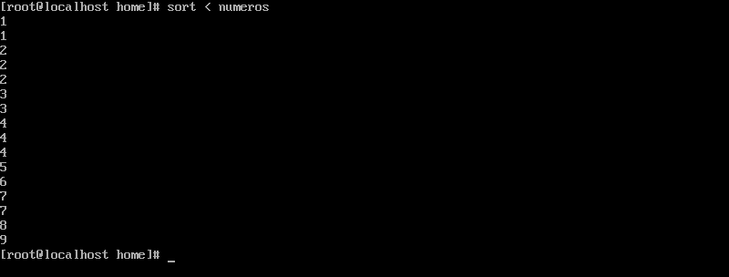

<h3 p align="center" > <i>Forgive me for any grammatical errors, English is not my native language. </i> </h3>

<h2 p align="center" > STREAMS </h2>

## Step 1 - STANDARD INPUT (STDIN).

 - Usually STDIN is data input by keyboard keys, but it can also be recognized by <b>"0<"</b> or just <b>"<" </b> which can be used to pass files as input instead of the standard input.

 - In practice it is as if we had used the command <b>"cat numeros"</b>, but in this example we use the file numeros as input for the cat. 

 - We can use other commands that expect an input, for example, <b>sort</b>. 

 - The flow can be continued with other output structures such as pipe. In the example sorting the numbers and not showing repetitions. 

## Step 2 - STANDARD OUTPUT (STDOUT).

 - We can identify STDOUT as the successful output, also identified by the commands <b>"1>"</b> or <b>">"</b>, where through an input we direct it with the objective of a successful output.

 - STDOUT differs from STDERR which we will talk about later, to recognize a successful output outside a script we can use the command "echo $?" right after a command. 

 - When the output of the command <b>"echo $?</b> be <b>"0"</b> shows that the command was successful, being a STDOUT. Any number other than 0 is an error output (STDERR). 

 - Note that we use <b>></b> to overwrite a file and <b>>></b> to add something one line below the targeted file. 

 - In this example the first time we use the cat command on the saida.txt file our output is "abcd". 

 - It can be seen that by using the <b>">"</b> with the values 123 we overwrite the previous contents of the file and its new output with cat is "123".

 - Already using <b>">>"</b> with the content "abcd", we can see that we have added this new text below the last existing content in the saida.txt file.

 - Your new exit is:  123 abcd 

## Step 3 - STANDARD ERROR (STDERR).

 Any output that results in an error is considered an STDERR. 

 - In the first command "ls" we have a successful output, showing the files in the directory we are in. 

 - Now in our second command we use the "-j" flag, which does not exist, giving us an error output. 

 - We use the <b>2></b> to redirect the error output to a file. Similarly to STDOUT, we can use <b>2></b> and <b>2></b>, to overwrite and add respectively. 

## Step 4 - REDIRECTING OUTPUTS.

 - In the following example I created a simple script with the following content:   
echo "Hello" 
ls -j  

 - When running it we will have both outputs, STDOUT and STDERR. 

 - If we try to redirect the output as STDOUT to a file, we would have a problem. 

 - Notice that by directing the output of the script to the output.txt file we still have the error as the output of the command, and by using cat in the saida.txt file we notice that only the successful output was saved inside it. 

 - We can have the opposite result using a STDERR output "2>", now the content of an error output was saved in the file saidaerr.txt and the successful output appeared in the terminal being the string "Hello". 

 - But how can we save both outputs in one file, or better save each output in its respective type. 

 - We can use the following logic. 

 - If you want to save both outputs in one file we only use the following structure: "./script.sh > saida_and_saida_err.txt, where the content of the successful output is directed to the file in question and at the end of the syntax I am asking for the error output to also be directed to the successful output with the command <b>2>&1.</b>" 

 - This way with the cat command we can see that we have saved both types of output in one file. 

 - Using > and 2> we can direct each output type to a particular file as in the example above. 

## Step 5 - HEREDOCS.

 - There are situations where we need to write simple scripts containing more than one line without needing to access a text editor, we can use the <b>HereDocs</b>. 

 - This would be an unusual way of inserting line after line into a file via append. 

 - Using <b>HereDocs</b> makes this much simpler and more dynamic. 

 You can type multiple lines using the <b><<</b>, followed by a keyword to determine the beginning and end of the command. We use the word EOF which comes from the early days of computing, meaning End of file. 

 - Now let's understand the functionality of this command, note that all the input from the "<<" is destined for the cat command which in turn is directed as a standard output to the texto_heredocs file. 

 - Using the cat text_heredocs command we can see that all the text has been inserted into the file via this stream. 

